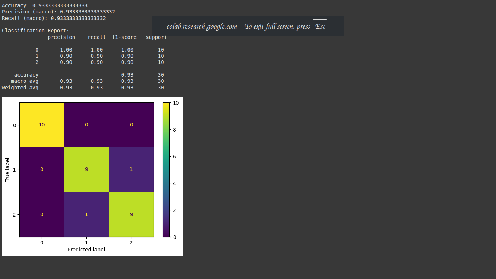
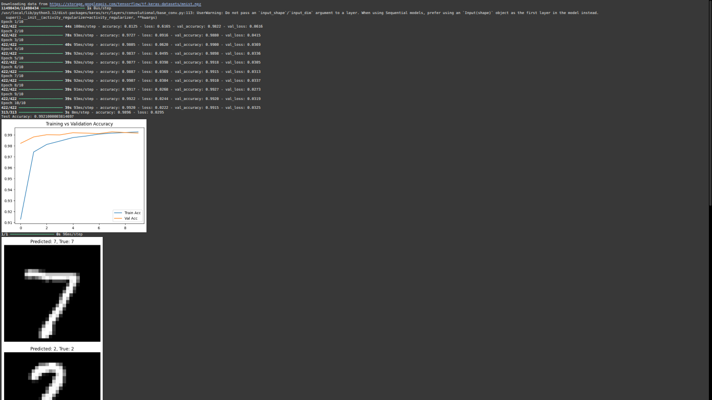
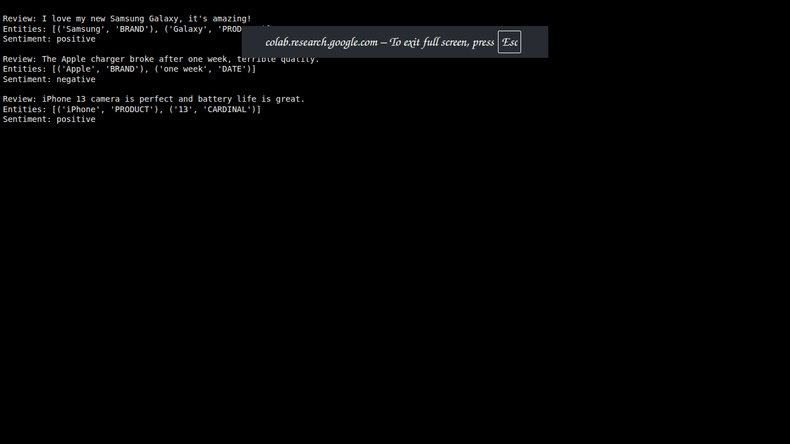

AI-Tools-Assignment/
│
├── Part1_Theory.pdf
├── iris_decision_tree.ipynb
├── mnist_cnn.ipynb
├── spacy_ner_sentiment.ipynb
├── mnist_cnn.h5
├── app.py
│
├── screenshots/
│   ├── iris_output.png
│   ├── mnist_accuracy.png
│   ├── mnist_streamlit.png
│   └── spacy_results.png
│
├── README.md
├── requirements.txt
└── Ethical_Considerations.pdf

# AI Tools & Frameworks Assignment

This project demonstrates practical and theoretical understanding of **AI tools and frameworks** including TensorFlow, PyTorch, Scikit-learn, and spaCy — along with ethical reflection and deployment skills.


## 📘 Table of Contents
1. [Overview](#overview)
2. [Part 1: Theoretical Understanding](#part-1-theoretical-understanding)
3. [Part 2: Practical Implementation](#part-2-practical-implementation)
   - [Task 1: Classical ML – Scikit-learn](#task-1-classical-ml--scikit-learn)
   - [Task 2: Deep Learning – TensorFlow](#task-2-deep-learning--tensorflow)
   - [Task 3: NLP – spaCy](#task-3-nlp--spacy)
4. [Part 3: Ethics & Optimization](#part-3-ethics--optimization)
6. [Results & Screenshots](#results--screenshots)
7. [Installation & Running](#installation--running)

---

## Overview

This assignment evaluates understanding and practical application of AI frameworks.  
It includes:
- Theoretical comparison of tools (TensorFlow, PyTorch, Scikit-learn, spaCy)
- Implementation of ML, Deep Learning, and NLP tasks
- Ethical considerations and optimization
- (Bonus) Deployment of a Streamlit web app for MNIST digit classification

---

##  Part 1: Theoretical Understanding

**Topics Covered:**
- Differences between TensorFlow and PyTorch
- Use cases of Jupyter Notebooks in AI development
- How spaCy enhances NLP vs. plain Python string operations
- Comparative analysis: Scikit-learn vs. TensorFlow

📄 Full written answers are available in the [Part1_Theory.pdf](./Part1_Theory.pdf) file.


## Part 2: Practical Implementation

### Task 1: Classical ML – Scikit-learn
**File:** [`iris_decision_tree.ipynb`](iris_decision_tree.ipynb)
**Dataset:** Iris Species
**Goal:** Predict iris flower species using a Decision Tree Classifier

**Steps:**
1. Preprocess data (handle missing values, label encoding)
2. Train and evaluate using accuracy, precision, recall
3. Display metrics and confusion matrix

📸 Output:


### Task 2: Deep Learning – TensorFlow
**File:** [`mnist_cnn.ipynb`](mnist_cnn.ipynb)
**Dataset:** MNIST Handwritten Digits
**Goal:** Train a CNN model to classify digits (0–9)
**Target Accuracy:** >95%

**Steps:**
1. Build CNN architecture with Conv2D, MaxPooling, Flatten, Dense layers
2. Train model and visualize accuracy/loss
3. Save trained model as `mnist_cnn.h5`

📈 Model Accuracy:


### Task 3: NLP – spaCy
**File:** [`spacy_ner_sentiment.ipynb`](spacy_ner_sentiment.ipynb)
**Dataset:** Amazon Product Reviews
**Goal:** Perform Named Entity Recognition (NER) and Sentiment Analysis

**Tools Used:** `spaCy` and rule-based sentiment scoring

📊 Example Output:
Review: I love my new Samsung Galaxy, it's amazing!
Entities: [('Samsung', 'BRAND'), ('Galaxy', 'PRODUCT')]
Sentiment: positive

📸 Screenshot:



## Part 3: Ethics & Optimization

**Topic:** Addressing bias in AI models  
- **MNIST bias:** Class imbalance and overfitting mitigation using data augmentation  
- **NLP bias:** Word sentiment skew in product reviews  
- **Tools:** TensorFlow Fairness Indicators, spaCy rule-based systems

**Discussion included in:** [`Ethical_Considerations.pdf`](Ethical_Considerations.pdf)

## Bonus Task: Model Deployment

**Framework:** Streamlit
**Goal:** Create a web interface for MNIST digit prediction

**Files:**
- [`app.py`](app.py)
- `mnist_cnn.h5`

**Run Command:**
```bash
streamlit run app.py
```

*For Google Colab deployment with public link:*
```python
from pyngrok import ngrok
ngrok.set_auth_token("YOUR_TOKEN")
public_url = ngrok.connect(8501)
!streamlit run app.py --server.port 8501
```
🧾 Results & Screenshots
Task	Tool/Framework	Result
Iris Classification	Scikit-learn	97% Accuracy
MNIST CNN	TensorFlow	98% Test Accuracy
Amazon Reviews NER	spaCy	Correct Brand/Product Extraction
Streamlit App	Streamlit + TensorFlow	Working Web Interface


##🧑‍💻 Installation & Running
To reproduce this project:

bash
Copy code
# Clone the repository
git clone https://github.com/your-username/AI-Tools-Assignment.git
cd AI-Tools-Assignment

# Create environment
python -m venv venv
source venv/bin/activate  # (or venv\Scripts\activate on Windows)

# Install dependencies
pip install -r requirements.txt
Then run the notebooks in Jupyter or execute the Streamlit app:

```bash
# Run individual notebooks
jupyter notebook iris_decision_tree.ipynb
jupyter notebook mnist_cnn.ipynb
jupyter notebook spacy_ner_sentiment.ipynb

# Or run the Streamlit app
streamlit run app.py
```
